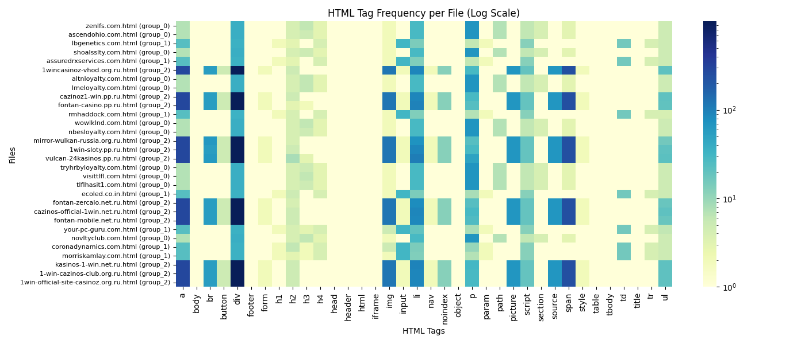

# HTML Grouping Pipeline

## Objective
- Automated grouping of HTML documents, which are similar from the perspective of a user who opens them in a web browser - by structural similarity and textual similarity.   
- This project uses ML techniques and Applied Statistical Analysis, with a great interest in scalability methods. 

---

## What does this project do?

- This project **automatically groups HTML documents that look similar** when opened in a web browser. It does this by analyzing both their structure (based on HTML tag usage) and text content, combining these signals using a mix of machine learning and statistical analysis. Behind the scenes, it uses unsupervised clustering (DBSCAN) to detect patterns and group similar pages together — no labels or manual intervention needed.
  
- The core idea is to treat **each HTML page** as a vector of **tag frequencies**, compute Chi-squared distances to measure structural differences, and combine this with textual similarity (TF-IDF). The result is a good pipeline for organizing large sets of web pages into meaningful groups, with an UI Dashboard built for visual validation, post-processing, and heatmap-based analysis.

- And yes — there's a dashboard! You can explore the results, check stats, and dig through logs in an intuitive UI. It makes the whole experience not just powerful, but also pretty fun.

---

## Installing

```bash
git clone https://github.com/alexecse/V5_assignment.git
cd V5_assignment

unzip clones.zip

python3 -m venv venv
source venv/bin/activate
pip install -r requirements.txt
```

---

## Running

```bash
python run.py
```
run those commands in two different terminals for the UI - containing the output, stats, and logs:
```bash
cd V5_assignment
source venv/bin/activate
python server_html.py
```
```bash
cd V5_assignment
source venv/bin/activate
streamlit run dashboard.py 
```
run this command to clean output/ statistics/ screenshots/ directories:
```bash
python clean.py
```

---

## Technical Documentation


- [1. Theory and Methodology](#1-theory--methodology)
- [2. Implementation](#2-implementation)
- [3. Conclusions & Expanding](#3-conclusions--future-work)

---

## 1. Theory & Methodology

### Objective

- Automated grouping of visually similar Web pages, by performing different kinds of analysis on their attached HTML document
- Rigourous evaluation of the methods used for structural similarity
- Exploration and research through different metrics: structural, textual and visual
- Explore different approaches of clustering
  - DBSCAN
  - HDBSCAN
  - others

<details><summary><b>What has statistics to do with it?</b></summary>

## This section is a theoretical approach on what can we do with statistics regarding HTML documents and data in general.

Statistical tools and reasoning can significantly enhance one's ability to analyze a problem.

---

## 1. Exploratory Data Analysis (EDA)

- **Distributions** of HTML tag frequencies across documents
- **Boxplots** to visualize tag variance and outliers
- **Correlation analysis** between tags
- **Density plots** for tag richness or text length

EDA good for:
- Choosing good filtering thresholds (e.g., `min_total_freq`)
- Detecting noisy or rare tags

---

## 2. Feature Scaling and Normalization

Applying statistical transformations helps balance features:

- **Z-score normalization** for standard deviation control
- **Min-max scaling** to fit within [0, 1]
- **Log(1 + x)** transform for skewed tag distributions

Prevents domination by frequent tags and stabilizes distances

---

## 3. Statistical Testing Between Clusters

Compare groups with:
- **ANOVA**, **t-tests**, or **Kruskal-Wallis** on:
  - Tag count
  - Content length
  - Visual features (e.g., color count)

These tests can validate that groups are statistically different

## General Tests - What do we Choose?

| **Data Type** | **Distribution** | **Independent Groups** | **Matched (Dependent) Groups** |
|---------------|------------------|--------------------------|-------------------------------|
| **Metric data** *(interval, ratio)* | Normal distribution<br> Sample > 30–40 | - Independent sample T-Test<br>- ANOVA<br>- **Chi-Square** | - Paired T-Test<br>- ANOVA |
|               |  Non-normal<br> Sample < 30 | - Mann–Whitney U Test<br>- Kruskal–Wallis | - Wilcoxon Matched Pairs Rank Test<br>- Friedman |
| **Ordinal data** | Nonparametric | - **Chi-square** (Goodness of Fit, Independence, Homogeneity)<br>- Mann–Whitney U Test | - Wilcoxon Matched Pairs Rank Test |
| **Nominal data** | Nonparametric / Association | - **Chi-square** (Goodness of Fit, Independence, Homogeneity)<br>- Fisher Exact Test *(small samples)* | - McNemar Test<br>- Cochrane Q Test |

---


</details>

### Approach

- An HTML document is a **ierarhical structure**, thus we can try and perform statitical analyisis on it
- Tested metrics:
  - structural: Chi-squared Distance + frequency matrices (no. of appereances / tag)
  - simplified structural: Cosine Distance + Binary frequency matrices (tag =1 or no tag = 0)
  - textual: TF-IDF
  - visual embeddings: not much exploration done here, as I use it only in the postprocessing

<details><summary> Structural Analysis </summary>

### Why Chi-squared + Frequency? (vs Cosine + Binarization)

I tested two approaches for comparing HTML structures.

---


| **Aspect**            | **Chi-squared + Frequency**                                       | **Cosine + Binary Presence**                                  |
|-----------------------|-------------------------------------------------------------------|----------------------------------------------------------------|
| **Representation**    | Vectors with tag counts (e.g., `<div>` = 50)                     | Binary vectors (1 = tag present, 0 = not present)              |
| **Distance Metric**   | Chi-squared distance                                              | Cosine similarity                                              |
| **Pros**              | - Captures **how often** each tag is used  <br> - Good for distinguishing structurally similar templates with different behaviors | - Tolerant to frequency variation <br> - Works well when layout is similar |
| **Cons**              | - Sensitive to file length differences <br> - Rare tags can dominate the distance | - Ignores **tag frequency** <br> - Misses subtle structural differences |

---

### Real Results

| Tier     | Chi² + Frequency        | Cosine + Binary         |
|----------|--------------------------|--------------------------|
| Tier 1   | 7 groups, 9 outliers     | 3 groups, 0 outliers     |
| Tier 2   | 2 groups, 6 outliers     | 1 group, 0 outliers      |
| Tier 3   | 5 groups, 4 outliers     | 1 group, 1 outlier       |
| Tier 4   | 3 groups, 4 outliers     | 2 groups, 0 outliers     |

**Interpretation:**  
**Chi-square + frequency** gives more **precise, meaningful clusters**.  
Cosine + binary overgeneralizes — fewer outliers, but also less useful grouping.

</details>

### Structural Pattern Discovery

Clustering decisions are supported by structural similarity across HTML tags, and backed by statistics.

A logaritmic scale was used to enhance visibility of tag frequencies that vary widely. It helps highlight both rare and common tags, which would otherwise be indistinguishable on a linear scale, making structural differences between HTML files easier to observe.

#### Heatmap Anatomy:
- **Rows:** All `.html` files from the current tier, labeled with their assigned group (e.g. `group_2`, `outlier`, etc.)
- **Columns:** Unique HTML tags found across all files (sorted alphabetically)
- **Cell values:** Number of times a given tag appears in a file
- **Color scale:** From light (rare tag) to dark blue (frequent tag)

These heatmaps offer a compact and intuitive way to **verify cluster quality**, **identify outliers**, and **debug the structural consistency** of HTML pages.

As we can see from the two heatmaps below, clear structural similarities emerge between the files.



From the heatmap above - tier4 and below - tier1, we observe distinct usage patterns across clusters. Some groups heavily use `div`, `p` `li`, and `span`, while others rely more on `input`, `script`, and `img`, which influences structural distance calculations.


These visual patterns validate the use of structural features and support the effectiveness of the clustering strategy, based on Fast Chi-squared Distance.

### Why use the Chi-squared Distance?

When comparing the **structure of HTML documents**, we represent each file as a frequency vector of HTML tags (e.g. `{div: 63, p: 32, span: 14, img: 0, ...}`).  
This creates a **categorical distribution** — and for that, **Chi-squared Distance** is the perfect fit.

---

#### Key Reasons for Using Chi-squared Distance

1. **Compares frequency distributions**  
   Chi-squared is designed to measure dissimilarity between two **discrete distributions** — exactly what we get when we count HTML tags.

2. **Normalization by total frequency**  
   
   
   Its formula:
   - Highlights differences on **rare tags** more than frequent ones.
   - Reduces the impact of large raw counts that may dominate in simpler metrics.

4. **Insensitive to absolute document size**  
   Two HTML files might have different tag counts (100 vs 10), but the same overall structure.  
   Chi-square captures **distributional similarity**, not raw volume.

5. **Widely used in document analysis**  
   - Common in NLP and Bag-of-Words models  
   - Proven effective for unsupervised clustering of documents based on frequency features

---

### Why Not Cosine Similarity?

- Measures the **angle** between vectors, not the shape of their distribution.
- Ignores magnitude and **fails to emphasize rare tag differences**.
- Good for topic modeling or TF-IDF, less useful for structural layout.

---

### Why Not Euclidean Distance?

- Measures **absolute difference**, not relative.
- Over-penalizes long documents.
- Sensitive to scale, **doesn't normalize** across documents.

---

### Statistical Intuition

Chi-squared Distance originates from inferential statistics — specifically, the **Chi-square test**, which checks if 2 ore more independent groups, that follow the normal distribution and have a sample volume greater than 30-40 units, differ significantly.  
In this context:
- Each HTML file is a distribution of tag frequencies.
- Chi-squared tells us **how structurally different** two pages are, based on tag usage.

---

**Chi-squared Distance** is a statistically grounded metric, optimized for comparing categorical frequency vectors (like HTML tag usage). It handles scale, highlights rare features, and outperforms more generic metrics in structural similarity tasks.

<details><summary>Long live Numerical Methods: Fast Chi-Squared Distance Numerical Optimization</summary>

### Fast Chi-Squared Distance Computation: Numerical Optimization

### Overview
In the context of clustering HTML documents based on tag distributions, I use the **Chi-squared distance** as a dissimilarity metric. The original implementation involved a nested loop over all pairs of documents, which resulted in high computational complexity.

To address this, we introduce a **vectorized implementation** of Chi-squared distance using NumPy. This approach provides substantial performance gains, especially for large datasets.

---

### Chi-Squared Distance Formula
Given two vectors x, y in R^d, the Chi-squared distance is defined as:


Where:
-  x_i, y_i  are the components of the vectors
- epsilon is a small constant added to avoid division by zero

---

### Vectorized Implementation
Instead of using nested loops over all \( n \) pairs, we perform the computation row-wise in a vectorized fashion using NumPy:

```python
for i in range(n):
    xi = X[i]
    denom = xi + X + epsilon  # shape: (n, d)
    num = (xi - X) ** 2       # shape: (n, d)
    chi2 = 0.5 * np.sum(num / denom, axis=1)
    dist_matrix[i, :] = chi2
```

This approach avoids redundant computation and leverages NumPy's optimized internals.

---

### Complexity Analysis

### Original Implementation
- **Time complexity**: \( \mathcal{O}(n^2 \cdot d) \)
- **Space complexity**: \( \mathcal{O}(n^2) \) for distance matrix
- Bottleneck: Python-level loops over all pairs of documents

### Vectorized Version
- **Time complexity**: Still \( \mathcal{O}(n^2 \cdot d) \), but drastically faster in practice
- Gains come from memory locality, CPU vectorization, and NumPy broadcasting

---

## Advantages of the Fast Method
- **10x to 50x faster** than naive Python implementation
- Easy to integrate with existing pipelines
- Retains full numerical accuracy of Chi-squared distance
- Can be extended with Numba or run in <b>batches</b> for <b>scalability</b>

---

### Conclusion
This optimized Chi-squared computation method makes it feasible to cluster large sets of HTML documents using document structure features, without incurring massive runtime penalties. It is a crucial enhancement for any scalable unsupervised clustering pipeline.

</details>

## 2. Implementation

### Pipeline Architecture (aka what actually happens)

The function `group_similar_htmls(directory, eps, min_samples, do_postprocessing=1)` follows the pipeline below:

1. **Parsing: HTML Tags Frequencies and HTML Text Extraction**
   - For each file in current folder:
     - Extract HTML tag frequencies using `parallel_extract_tag_frequencies()`.
     - Build the tag frequency matrix via `build_tag_matrix()`.
     - Extract visible text content using `parallel_extract_texts()`.
---
2. **Vectorization**
   - Compute the **Chi-squared distance matrix** from the tag frequency matrix:  
     `chi2_distance_matrix_fast()`
   - Compute the **textual similarity** between HTML files:  
     `compute_textual_similarity()`
   - Dynamically combine the two distances into a unified matrix:  
     `combine_distances_dynamic()`
---
3. **Clustering with DBSCAN (okay for medium datasets <10000 HTML files)**
   - Use `DBSCAN` on the combined distance matrix:
     ```python
     DBSCAN(eps=eps, min_samples=min_samples, metric='precomputed')
     ```
   - Pages are grouped into clusters. Outliers (pages that don’t fit anywhere) get label `-1`.
---
4. **Post-processing (optional)**
   - If `do_postprocessing` is enabled:
     - Outliers may be reattached to nearby clusters.
     - Small, similar groups can be merged.
     - Logs and stats are saved:
       - `postprocessing()`
       - `save_logs()`
       - `save_stats()`
---
5. **Output: Clustered Folder Structure**
   - All grouped HTML files are copied into:
     - `output/group_X/` for clusters
     - `output/outliers/` for unmatched pages
---
6. **Visualization: Heatmap**
   - A log-scaled heatmap of HTML tag usage is generated:
     - Y-axis = HTML files (with group info)
     - X-axis = HTML tag names
   - Log scale ensures both common and rare tags are visible.
   - Saved under: `statistics/<tier_name>_tag_frequency_heatmap.png`

### Implementation Highlights

Here are some key aspects of the implementation that make this pipeline efficient, scalable, and easy to extend:

- **Parallel Processing**
  - HTML parsing and both tag and text extraction are parallelized for speed using:
    ```python
    parallel_extract_tag_frequencies()
    parallel_extract_texts()
    ```
  - Uses `concurrent.futures` under the hood for thread/process-based concurrency.
---
- **Dynamic Distance Fusion**
  - Combines structural (Chi-squared) and textual (TF-IDF) distances dynamically:
    ```python
    chi2_dist = chi2_distance_matrix_fast(tag_matrix)
    textual_dist = compute_textual_similarity(html_files, texts)

    combined_dist = combine_distances_dynamic(chi2_dist, textual_dist)
    ```
  - Avoids manual weight tuning (ew...), adapts based on distribution of data
  - Useful when HTML is very sparse or very dense
---
- **Log-normalized Heatmap**
  - Final heatmap uses `LogNorm` to capture both frequent and rare HTML tags.
  - Offers high interpretability and helps debug the structural clustering quality.
---
- **Modular Code Design**
  - Each step is separated in its own python script.
    - `grouping.py`
    - `html_analysis.py`
    - `text_analysis.py`
    - `postprocessing.py`
    - `image_processing.py`
  - Easy to swap in for other (better) models 
    - tried HDBSCAN for clustering, didn't work that well on this dataset
--- 
- **Clean Folder Structure**
  - for each tier, HTML files are copied into:
    - `group_0/`, `group_1/`, etc.
    - `outliers/` for unmatched files.
---
- **Optional Post-processing**
  - When `do_postprocessing=1`, 
    - Outliers can be reattached to nearby clusters (by distance)
    - Small similar clusters can be merged (by visual similarity)
      - we take a single screenshot in each group
      - compare them
      - if they are over 93% similar, we merge their groups together, based on the fact that if two random files (with already assigned groups) are similar, their whole groups will be
    - While changes are logged for full traceability
---
- **Extensible Architecture**
  - Easy to extend for:
    - Other visual embeddings
    - Persistent search indexing 
      - considered FAISS
    - Internal metric evaluation for clustering quality
    - Live interactive dashboards via Streamlit

### Complexity

| Step                      | Complexity               |
|---------------------------|--------------------------|
| Parsing HTML              | O(n)                     |
| Frequency Matrix          | O(n × t)                 |
| Fast Chi-squared distance | O(n² × t), faster IRL    |
| DBSCAN                    | O(n²)                    |
| Postprocesare             | O(n × o)                 |

---

## 3. Conclusions & Future Work

### Conclusions

- **Chi-squared + frequency** is the most robust metric for capturing structural differences.
- **Cosine + binarization** is faster but less precise, especially when structural usage patterns matter.
- **Hybrid approaches** (structure + text + visual features) significantly improve clustering quality.

---

### Future Extensions

- [ ] **FAISS persistent index** for fast, incremental nearest-neighbor search
- [ ] **Replace DBSCAN with HDBSCAN** for better density-based clustering with variable density handling
- [ ] **Automatic cluster quality evaluation** 

---
## Unanswered Questions

### How Could This Scale to 2000 HTML Files per Second?

Veridion processes ~2000 HTML documents **per second**. 
In its current form, this pipeline is not designed for that scale. To reach production-grade throughput, several architectural and algorithmic upgrades are to be made.

#### Problems in the current setup:

- **Fast Chi-squared distance matrix** is fast in practice, however it is still quadratic: `O(n² × d)`
- **DBSCAN** does full pairwise comparisons: not suitable for massive datasets
- **In-memory processing** limits parallelism and fault tolerance

### Can I Make Clusters Persistent Over Time?

At some point I started wondering...

> What happens if I cluster 10 websites today — and then, a week later, I process a new site that *clearly* belongs with one of those earlier groups?

Should I re-cluster everything from scratch? That doesn't scale.

I started exploring ways to **retain the "identity" of each cluster** so I could incrementally assign new HTML files without recomputing the entire distance matrix.  

---

### What I Thought I Needed

To support incremental grouping, I would probably need to:

- Store the **feature vectors** (Chi²-based or TF-IDF) of all previously clustered files
- Somehow save the **profile** of each cluster
- Compute distance from a new page to existing clusters
- Decide: *Attach to existing? Create new? Mark as outlier?*

But then more questions came up...

- How do I define a cluster "centroid" if the input is sparse tag frequencies?
- How much variation within a group is acceptable before a new file is "too different"?
- How do I scale this up when I reach thousands of groups?

---

### What Got Overwhelming

As I kept thinking about it, the challenges started piling up:

- **Memory usage** for keeping all vectors if I go beyond 10k+ HTMLs
- **No easy way** to do fast similarity search on structured + text + visual combos
- **Thresholds** would need tuning per domain / tier — not a general solution
- Rebuilding a proper system around this would mean **a full ANN + indexing layer** and moving away from the simplicity of DBSCAN

To be continued?
